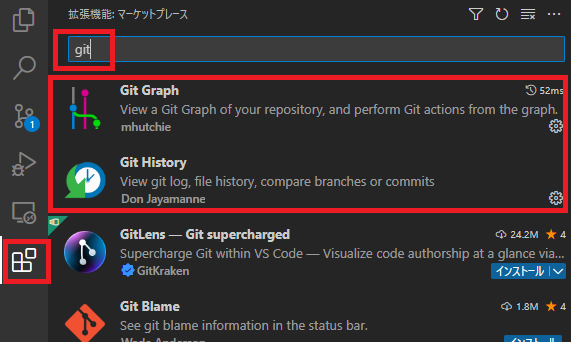

# MCC Git-C 言語講座

今回は Git を使って C言語 でリバーシプログラムを作ります。

## Git の環境構築

vscode の拡張昨日から検索欄に`git`と入れ、 Git Graph 、 Git History 、 GitLens の3つをインストールしてください。

git graph はいらない？



インストールしている間に Git の概要を話したいと思います。

## Git とは

Git とは、ソースコードなどの変更履歴を記録・追跡するための**バージョン管理システム**です。Git を使うことで、誰が、いつ、どのような変更を行ったかを記録することができます。

覚えてほしい単語

```
repository
- local repository
- remote repository
clone
commit
branch
- local branch
- remote branch
push
pull
pull request
marge
conflict
Github
```

## repository (リポジトリ)

リポジトリとは、バージョン管理システムで管理したい範囲のファイルやディレクトリと、それらの**変更履歴データなどをまとめたもの**です。基本的に、1つのアプリケーションを作るときなど、1つのプロジェクトに対して1つのリポジトリを作成します。

リポジトリはローカルリポジトリとリモートリポジトリの2種類があります。サーバー上(リモート)にあるリポジトリをリモートリポジトリと呼び、自分のパソコン(ローカル)にあるリポジトリをローカルリポジトリと呼びます。

## clone (クローン)

クローンとは、**リモートリポジトリをローカル環境に複製すること**です。複製してローカル環境にできたリポジトリをローカルリポジトリと呼びます。リモートのmainブランチにあったファイルやディレクトリと、Gitのデータも複製されます。

たぶん、VScode の Git の拡張機能のインストールが終わったと思います。このリポジトリをクローンしてみましょう。

* VScode で clone する手順

ctr + p を押してコマンドパレットを表示。(Mac は多分 Command + p)

コマンドパレットに`> git clone` と入力し、`git クローン`を選択。 github から複製を選ぶ。Github にログインしていない場合はログインする。権限はすべて許可してください。


`tuatmcc/mcc-c-git-lec`を選択してください。


クローンする場所は好きな場所にクローンしてください。クローンしたら開いてください。

`README.md` を開いてください。この資料が見れると思います。


## commit (コミット)

コミットとは、ファイルやディレクトリの追加・変更・削除などの**変更履歴をリポジトリに記録すること**です。コミットすると、その時点のファイルやディレクトリの状態が記録されます。コミットするときは、どのような追加・変更・削除を行ったかを示すコミットメッセージを一言程度で書きます。

ここで、このリポジトリのコミット履歴を見てみましょう。左の方の GitLens のアイコンを押して、 Commit Graph を選択してください。すると、下の方にコミット履歴が見れると思います。下の画像はちょっと前のやつなので、みなさんが見ているものとは異なると思います。


１つ１つがコミット履歴です。誰が、いつ(いつぐらい前)、何を編集したのかわかると思います。ためにし過去のコミット履歴を１つ選択して、右の方の `COMMIT GRAPH DETAILS` をみてください。コミットの詳しい内容が書いてあります。`FILES CHANGED` の欄が１番大事です。この欄には、そのコミットでどのファイルがどのように変更されたのかが書いてあります。


なにか１つファイルを選択してみてください。すると、そのコミットでのそのファイルの差分が見れます。左側に変更前、右側に変更後があります。ソースコードなどのテキストファイルでは、そのコミットで削除された部分は変更前のところに赤くハイライトされます。追加された部分は変更後のところに緑でハイライトされます。


コミット試しはブランチの説明の後で行います。

## branch (ブランチ)

ブランチとは、**変更履歴を記録していく系統**です。ブランチは分岐することができます、複数人での作業を効率的に行うことができます。ブランチを切ると、そのブランチには現在のブランチの情報がコピーされます。ブランチを切るときは、現在のブランチの情報をコピーして新しいブランチを作成するので、ブランチを切るときは、現在のブランチの情報をコミットしておく必要があります。

