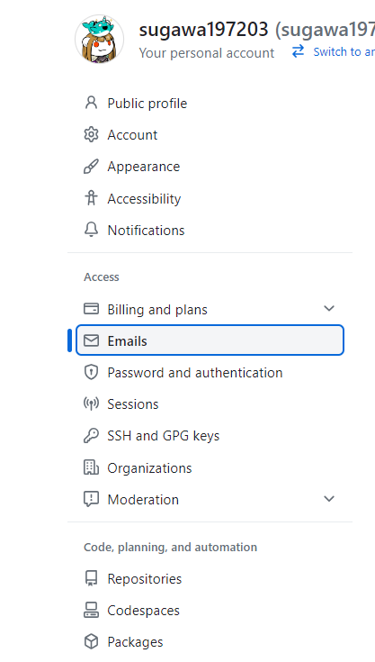
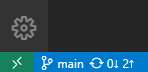
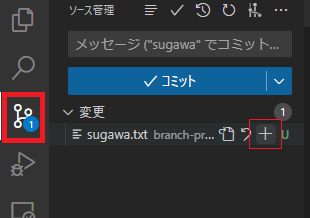
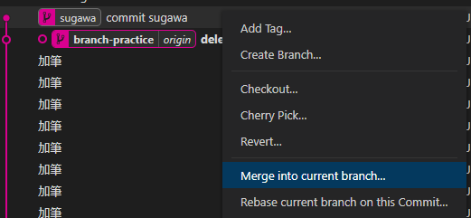

# MCC Git-C 言語講座

今回は Git を使って C言語 でリバーシプログラムを作ります。はじめに Git について触れてからプログラムを作っていきます。

## Git の環境構築

### Git のインストール

説明の前に先にインストールします。 Windows と Mac でインストール方法が違うので、それぞれの OS でインストールしてください。 Linux の人は自力でやってください。

* Windows

[ここ](https://git-scm.com/download/win)をクリックしてダウンロードページを開いてください。

開いたら `64-bit Git for Windows Setup.` をクリックしてインストーラーをダウンロードしてください。


インストーラーを起動してください。基本的に設定はデフォルトのままで構いません。 Next を押していってください。


* Mac

ターミナルで `brew install git` を実行するとできるそうです(未検証)。担当の人が確認してくれます。

### Github のアカウント作成

アカウントを持ってない人は[ここ](https://github.com/)からアカウントを作成してください。たぶんみんな持ってるはず。

### MCC の Organization に招待

MCC の Organization に招待します。アカウント名を教えてください。担当者がやってくれます。たぶんみんな入ってるはず。

### Git の設定

* メアドの設定

Git でコミットするときに使うメールアドレスを設定します。ここでは**実際のメアドを使いません**。 **Github のダミーメールアドレスを使います**。

[github.com](https://github.com/) にアクセスし、右上の自分のアイコンをクリックしてください。


Settings をクリックしてください。


左の方にある Emails というところをクリックしてください。



`Keep my email addresses private` をチェックしてください。 `We’ll remove your public profile email and use` の後にあるメールアドレスがダミーメールアドレスです(下の画像だと `96975428+sugawa197203@users.noreply.github.com` がダミーメールアドレス)。これをコピーしてください。


ターミナルを開いてください。そして以下のコマンドを実行してください。 `メールアドレス` の部分は先ほどコピーしたダミーメールアドレスに置き換えてください。

```bash
git config --global user.email メールアドレス
```

これでメールアドレスの設定は完了です。

* ユーザー名の設定

Git でコミットするときに使うユーザー名を設定します。ここでは Github のユーザー名を使います。

ターミナルを開いてください。そして以下のコマンドを実行してください。 `ユーザー名` の部分は Github のユーザー名に置き換えてください。

```bash
git config --global user.name ユーザー名
```

これでユーザー名の設定は完了です。

### VScode の Git 拡張機能のインストール

vscode の拡張昨日から検索欄に`git`と入れ、 Git Graph 、 Git History の2つをインストールしてください。


インストールしている間に Git の概要を話したいと思います。

<br>
<br>

Git の環境構築は以上です！

<br>
<br>

## Git とは

Git とは、ソースコードなどの変更履歴を記録・追跡するための**バージョン管理システム**です。Git を使うことで、**誰が、いつ、どのような変更を行ったかを記録**することができます。

覚えてほしい単語

```
repository
- local repository
- remote repository
clone
commit
branch
- local branch
- remote branch
checkout
marge
push
pull
fetch
conflict
gitignore
Github
```

## repository (リポジトリ)

リポジトリとは、バージョン管理システムで管理したい範囲のファイルやディレクトリと、それらの**変更履歴データなどをまとめたもの**です。基本的に、1つのアプリケーションを作るときなど、1つのプロジェクトに対して1つのリポジトリを作成します。

リポジトリはローカルリポジトリとリモートリポジトリの2種類があります。サーバー上(リモート)にあるリポジトリをリモートリポジトリと呼び、自分のパソコン(ローカル)にあるリポジトリをローカルリポジトリと呼びます。

## clone (クローン)

クローンとは、**リモートリポジトリをローカル環境に複製すること**です。複製してローカル環境にできたリポジトリをローカルリポジトリと呼びます。リモートのmainブランチにあったファイルやディレクトリと、Gitのデータも複製されます。

たぶん、VScode の Git の拡張機能のインストールが終わったと思います。このリポジトリをクローンしてみましょう。

* VScode で clone する手順

ctr + p を押してコマンドパレットを表示。(Mac は多分 Command + p)

コマンドパレットに `> git clone` と入力し、`git クローン`を選択。 github から複製を選ぶ。Github にログインしていない場合はログインする。権限はすべて許可してください。


`tuatmcc/mcc-c-git-lec`を選択してください。


クローンする場所は好きな場所にクローンしてください。クローンしたら開いてください。

`README.md` を開いてください。この資料が見れると思います。


## commit (コミット)

コミットとは、ファイルやディレクトリの追加・変更・削除などの**変更履歴をリポジトリに記録すること**です。コミットすると、その時点のファイルやディレクトリの状態が記録されます。コミットするときは、どのような追加・変更・削除を行ったかを示すコミットメッセージを一言程度で書きます。

ここで、このリポジトリのコミット履歴を見てみましょう。下の方の GitGraph のアイコンを押してください。コミット履歴のグラフのタブが開きます。下の画像はちょっと前のやつなので、みなさんが見ているものとは異なると思います。


１つ１つがコミット履歴です。誰が、いつ、何を編集したのかわかると思います。ためにし過去のコミット履歴を１つ選択してみてください。コミットの詳しい内容が書いてあります。


左に書いてあるファイルを選択してみてください(以下の画像ならREADME.mdがわかりやすい)。すると、そのコミットでのそのファイルの差分が見れます。左側に変更前、右側に変更後があります。ソースコードなどのテキストファイルでは、そのコミットで削除された部分は変更前のところに赤くハイライトされます。追加された部分は変更後のところに緑でハイライトされます。


## branch (ブランチ)

ブランチとは、**変更履歴を記録していく系統**です。基本的に１つの機能につき、１つのブランチをつ作ります。以下に MCC のホームページのブランチを示します。ローカルにしかないブランチをローカルブランチ、リモートにしかないブランチをリモートブランチと呼びます。


ブランチ名が書いてあるコミットが、ローカルブランチでの最新のコミットです。ブランチ名に origin がついているコミットは、リモートブランチでの最新のコミットです。あとで実際に触れながら詳しく説明します。

## checkout (チェックアウト)

チェックアウトとは、**作業するブランチを切り替えること**です。ブランチを切り替えると、そのブランチの最新のコミットの状態になります。

試しに `branch-practice` ブランチにチェックアウトしてみましょう。

今皆さんは `main` ブランチにいると思います。 左下を見ると `main` と書いてあります。ここに書いてあるのが現在いるブランチです。また Git Graph を見ると `main` に ○ がついています。


`branch-practice` にチェックアウトします。 `branch-practice` の部分をダブルクリックしてください。


## merge (マージ)

マージとは、**ブランチの変更履歴を統合すること**です。ブランチを切り替えるときに、そのブランチの変更履歴を現在のブランチに統合することができます。

## pull (プル)

プルとは、**リモートリポジトリの変更履歴を取得すること**です。リモートリポジトリの変更履歴を取得すると、ローカルリポジトリの変更履歴にも反映されます。

## push (プッシュ)

プッシュとは、**ローカルリポジトリの変更履歴をリモートリポジトリに反映すること**です。ローカルリポジトリの変更履歴をリモートリポジトリに反映すると、リモートリポジトリの変更履歴にも反映されます。

## fetch (フェッチ)

フェッチとは、**リモートリポジトリの変更履歴を取得すること**です。プルとの違いは、フェッチではリモートリポジトリの変更履歴を取得するだけで、ローカルリポジトリの変更履歴には反映されません。

## commit, branch, checkout, merge, pull, push, fetch を試してみよう

現在のブランチは左下で確認できます。現在は `main` ブランチになっているはずです。確認してください。



* `branch-practice` にチェックアウトする

`branch-practice` ブランチにチェックアウト (ブランチの切り替え) をします。 Git Graph から、`branch-practice` をダブルクリックして下さい。それで、`branch-practice` ブランチにチェックアウトできます。


チェックアウト後は `branch-practice` になっているはずです。確認してください。


* my-branch を作成する

MCC の Discord の自分の名前の Branch を作ります。 `branch-practice origin` を右クリックし、 `Create Branch` を選択してください。


ブランチ名は MCC の Discord の自分の名前にして、 `Create Branch` してください。


自分の名前のブランチができたらこのようになります。


自分の名前のブランチをダブルクリックして、チェックアウトしてください。チェックアウトしたら、ちゃんと今開いているブランチが自分の名前のブランチか確認してください。


先程作成した自分の名前のブランチには `origin` がついていません。これは、自分の名前のブランチはまだリモートに存在しないからです。ローカルブランチしか存在しません。

* コミットする

自分の名前のブランチにチェックアウトができていたら、 branch-practice ディレクトリの中に `自分の名前.txt` というファイルを作成してください。中身は何でもいいです。


コミットをする前にステージします。ソースの管理から、 `自分の名前.txt` をカーソルを合わせると現れる + を押してステージしてください。

リポジトリ内のファイルを変更してコミットする際、コミットするファイルを選べます。選んだファイルがステージされ、ステージされたファイルのみコミットされます。特定のファイルだけ別のコミットにしたいときや、コミットしたくないファイルがあるときなどにこの機能は役立ちます。



ステージしたらメッセージを入力してください。ここではわかりやすく `commit 自分の名前` と入力してください。メッセージを入力したら Ctrl+Enter 、 (MacはたぶんCommand+Enter) もしくは `✓コミット` をクリックしてコミットできます。


コミットしたら Git Graph から自分の名前のブランチにコミットが反映されていることを確認してください。また、メッセージも反映できているか確認してください。


* マージする

`branch-practice` ブランチにチェックアウトしてください。自分の名前のブランチではアリません。


チェックアウトしたら、自分の名前のブランチを `branch-practice` にマージします。自分のブランチを右クリックし、 `Merge into Current Branch` を選択してください。



するとマージされ、 `branch-practice` から派生した自分の名前のブランチでコミットされ、 `branch-practice` にマージされる流れになっているか確認してください。


また、`branch-practice` を開いている状態で、自分の書いたテキストファイルがあるか確認してください。


* プッシュする

現在、ローカルの `branch-practice` の先頭と リモートの `branch-practice` の先頭は異なっています。ローカルでの変更 (自分のブランチをマージした事) をリモートに反映させるためにプッシュします。ソース管理のとこにある `変更の同期` もしくは 左下のブランチ名をクリックしてください。


プッシュしたら `branch-practice origin` が先頭になると思います。


* フェッチする

リモートでの変更の履歴 (みんなのpush) を取得します。Git Graph のタブの右上にある雲のアイコンをクリックしてフェッチしてください。あれれ、自動でフェッチしてくれるのかな？？？


フェッチ後の画像が無い！！！

とりあえず Git Graph 見るとみんなのやつがいっぱい乗ってるハズ、、、

* プルする

現在、リモートの変更の履歴をフェッチで取得しました。リモートの変更で変わったファイルをローカルのファイルに反映させます。ソース管理のとこにある `変更の同期` もしくは 左下のブランチ名をクリックしてください。


ぷるしたら `branch-practice` ディレクトリにみんなの名前のファイルがいっぱいあると思います。画像が無い！！！

とりあえずこんな感じでリポジトリの共同編集ができました。

## Conflict

ある main ブランチのコミットから A さんは a ブランチ、 B さんは b ブランチを作成しました。 A さんはもともとあったファイル Hoge.txt を削除しました。 B さんは Hoge.txt に加筆しました。 A さんは a ブランチを main ブランチにマージし、 B さんも b ブランチを main ブランチにマージしようとしました。 すると削除したはずの Hoge.txt を後から加筆するという訳のわからないことになってしまいます。このような状態をコンフリクト (衝突、競合) と言います。

こんなことが起きたら大問題です。

本来、チーム内で役割分担が正しく行われていれば、同じファイルを他の人に触られることは起きません。このような競合状態を起こさないことがチーム開発では必要です。

## gitignore

gitignore とは、Git で管理しないファイルを指定するためのファイルです。例えば、キャッシュファイルなどは Git で管理する必要がありません。このようなファイルを gitignore に指定することで、Git で管理しないようにできます。

`.gitignore` というファイルで Git で管理しないファイルを指定します。 `.gitignore` には `ignore` と書いてあります。試しに `ignore` というファイルを作成してみましょう。下の画像のようにグレーになり、ソースの管理で `ignore` というファイルがなく、ステージもできないのがわかると思います。


## Github

ここまでで、 Git の基本的なしくみがわかったと思います。共同編集の際、リモートリポジトリを保管する場所が必要になることがわかります。そこで、リモートリポジトリの管理を行うサービスが Github です。 Git の Hub です。 Github でリモートリポジトリの管理を行って、外部にリポジトリを公開すれば、他の人に簡単にコードを見てもらえます。また、プラグインなどを使えば、Pushすす際に指定したプログラムを実行することができたりします。 MCC のホームページはこの辺の技術をつかって作られています。

## まとめ

Google ドライブとかでプロジェクトをリアルタイムで更新すればいいんじゃない？とか言わないでください。いつ誰がどの部分を何したか、履歴を残せるのが Git の素晴らしい点です。